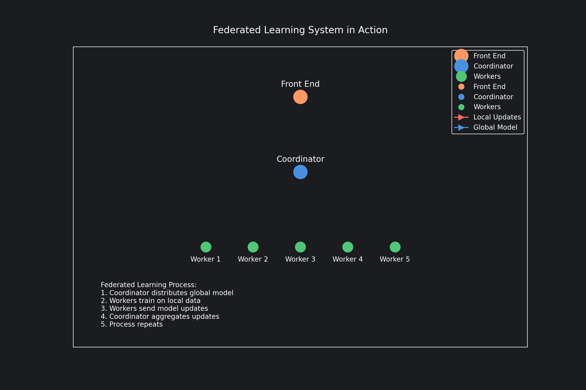

# 🤖 Federated Learning System in Rust

> 🔥 **Created entirely by [Memex](https://memex.tech)** 🔥
>
> Not a single line of this project was written by a human! The entire codebase, including this README, 
> was generated by the Memex coding agent. From system architecture to implementation, from visualization to documentation - 
> it's all AI-powered! 🚀



## Overview

A complete federated learning system implemented in Rust with real-time visualization and monitoring capabilities. The system demonstrates the practical implementation of federated learning principles, where multiple workers train on their local data while contributing to a global model.

## System Components

### Core System (Rust)
- **Coordinator**: Central server managing the federated learning process
  - Global model aggregation
  - Worker registration and management
  - Training coordination
- **Workers**: Distributed training nodes
  - Local model training
  - Parameter updates
  - Model synchronization
- **Model**: Linear model implementation with serialization support
  - Parameter management
  - Forward pass computation
  - Federated averaging implementation

### Visualization & Monitoring (Python)
- **Real-time Dashboard**: Built with Streamlit
  - Training progress visualization
  - Worker performance monitoring
  - Convergence analysis
  - System metrics
- **Worker Simulation**: Testing and demonstration
  - Simulated distributed training
  - Configurable worker behavior
  - Real-time updates

## Requirements

### Rust Components
- Rust 2021 edition
- Dependencies:
  - tokio (async runtime)
  - axum (web framework)
  - ndarray (numerical computations)
  - serde (serialization)

### Python Components
- Python 3.9+
- Dependencies:
  - streamlit
  - plotly
  - pandas
  - numpy

## Installation

```bash
# Clone the repository
git clone https://github.com/davidvgilmore/fl-system-rust.git
cd fl-system-rust

# Build Rust components
cargo build

# Set up Python environment
python -m venv .venv
source .venv/bin/activate  # On Windows, use `.venv\Scripts\activate`
pip install -r dashboard/requirements.txt
```

## Usage

1. Start the Rust server:
```bash
cargo run
```

2. Launch the Streamlit dashboard:
```bash
streamlit run dashboard/app.py
```

3. Run worker simulation (optional):
```bash
python dashboard/simulate_workers.py
```

## Project Structure

```
.
├── src/
│   ├── main.rs           # Server implementation
│   ├── coordinator.rs    # Federated learning coordinator
│   ├── worker.rs         # Worker implementation
│   └── model.rs          # Linear model and federated averaging
├── dashboard/
│   ├── app.py           # Streamlit dashboard
│   └── simulate_workers.py # Worker simulation
└── README.md
```

## Features

- **Asynchronous Communication**: Built on tokio for efficient async operations
- **Real-time Monitoring**: Live training progress and performance metrics
- **Federated Averaging**: Efficient model parameter aggregation
- **Interactive Dashboard**: Rich visualizations and system insights
- **Scalable Architecture**: Support for multiple concurrent workers
- **Robust Error Handling**: Graceful handling of worker failures and edge cases

## License

MIT License

## Contributing

Contributions are welcome! Please feel free to submit a Pull Request.
