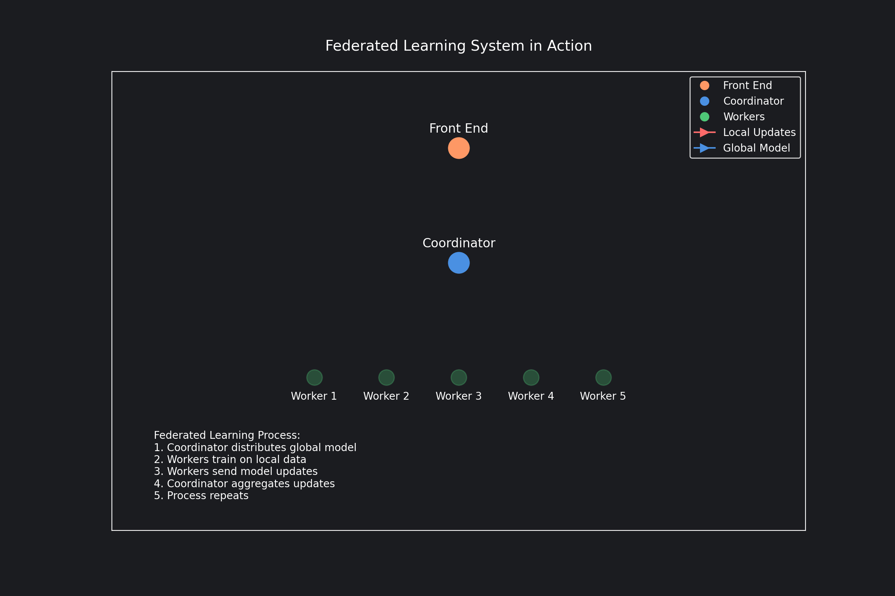

# 🤖 AI-Generated Federated Learning Visualization 

> 🔥 **Created entirely by [Memex](https://memex.tech)** 🔥
>
> Not a single line of this project was written by a human! The entire codebase, including this README, 
> was generated by the Memex coding agent. From conceptualization to visualization, from documentation to repo setup - 
> it's all AI-powered! 🚀

## 🎨 Federated Learning System Visualization

A dynamic visualization of a federated learning system architecture using Python and Matplotlib.



## Overview

This visualization demonstrates the key components and interactions in a federated learning system:

- **Front End**: The user interface layer that receives updates from the coordinator
- **Coordinator**: The central node that manages the federated learning process
- **Workers**: Distributed nodes that perform local training on their respective data

## Animation Phases

The visualization shows four main phases of the federated learning process:

1. **Local Training**: Workers pulse to indicate local model training
2. **Update Collection**: Red arrows show local model updates being sent to the coordinator
3. **Aggregation**: Coordinator pulses during model aggregation and communicates with the front end
4. **Model Distribution**: Blue arrows show the updated global model being distributed back to workers

## Requirements

- Python 3.9+
- matplotlib
- numpy
- pillow

## Installation

```bash
# Clone the repository
git clone https://github.com/YourUsername/federated_learning_visualization.git
cd federated_learning_visualization

# Create a virtual environment
python -m venv .venv
source .venv/bin/activate  # On Windows, use `.venv\Scripts\activate`

# Install dependencies
pip install matplotlib numpy pillow
```

## Usage

```bash
python federated_learning_viz_v2.py
```

This will generate a GIF file named `federated_learning_system_v2.gif` in the current directory.

## Project Structure

```
.
├── README.md
├── federated_learning_viz_v2.py    # Main visualization script
├── federated_learning_system_v2.gif # Generated animation
└── requirements.txt                 # Project dependencies
```

## License

MIT License

## Contributing

Contributions are welcome! Please feel free to submit a Pull Request.
